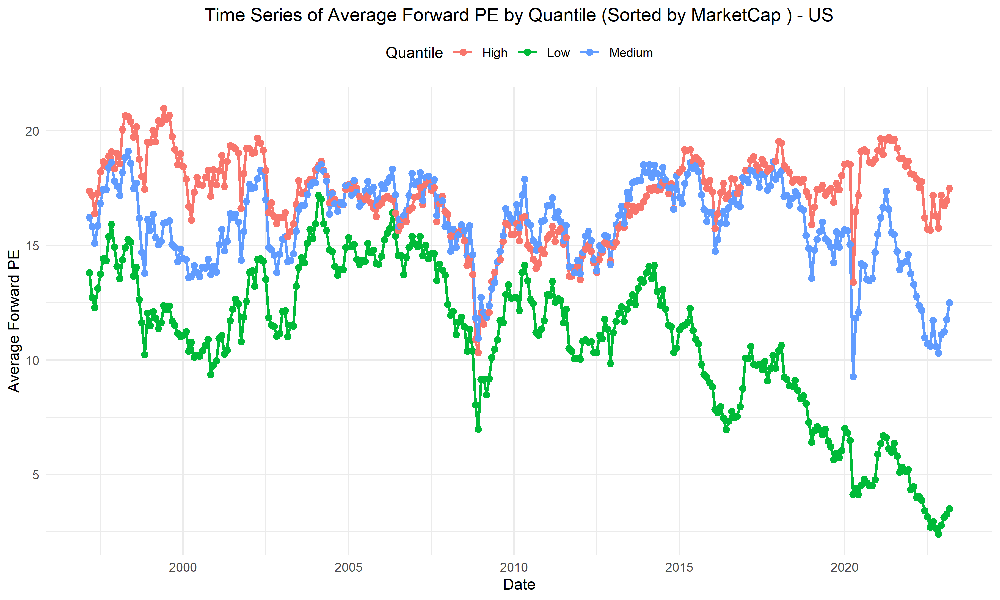

# **Project Overview**
This project analyzes the **style portfolio P/E ratio** over time across different markets.  
Portfolios are constructed based on the **Fama-French 5 factors (FF5) plus Momentum**, rebalanced **monthly**.  
The markets covered include **China, Taiwan, Hong Kong, the US, Japan, Korea, and Vietnam**.  (can be extended to other markets)

# **Data Source**
The data is sourced from **Datastream** (DFO), using the following codes for time series requests:

- **EPS1TR12** – Trailing EPS  
- **EPS1FD12** – Forward EPS  
- **WC07210** – Market cap (USD)  
- **WC08001** – Market cap (local currency)  
- **IBNOSH** – Number of outstanding shares  
- **IBP** – Price  
- **PTBV** – Price-to-Book (P/B)  
- **WC08316** – Operating profit margin  
- **WC08621** – 1-year annual asset growth  

For **industry classification**, the following codes are used in static requests:  
- **ICBIN**, **ICBSC**, **ICBSN**  

Due to the large dataset size, only a summary table (tracking the number of stocks per country per year across 30 countries) is included here. Please contact me if you need additional data for replication.

# **Main Files and Code Structure**
- **Primary analysis**: Conducted in `Style Portfolio Analysis.RMD`  
- **Data cleaning scripts**: Other Rmd files handle preprocessing and merging  

## **Key Components in `Style Portfolio Analysis.RMD`**
### **Dictionaries**
- `all_date_pe_dfs`: Stores P/E values over time for different style portfolios across countries  
- `all_portfolio_dicts`: Tracks portfolio construction over time  

### **Portfolio Construction**
- Portfolios are formed based on five key metrics:  
  - **Profitability**  
  - **Asset Growth**  
  - **Market Cap**  
  - **P/B Ratio**  
  - **Momentum (12M)**  
- Portfolios are rebalanced **monthly**  
- Additional classification is performed to distinguish **emerging markets** and **developed markets**  

# **Results**
- The **results folder** contains time series plots of style portfolio P/E values for each country  

Example

# **Main Dataset**
The **`merged_data`** file serves as the primary dataset.  
Each observation represents a firm at a specific date and includes:  

- **Country**  
- **Profitability**  
- **Asset Growth**  
- **Market Cap**  
- **P/B Ratio**  
- **Momentum (12M)**  
- **Industry**  
- **Forward P/E**  
- **Trailing P/E**  
